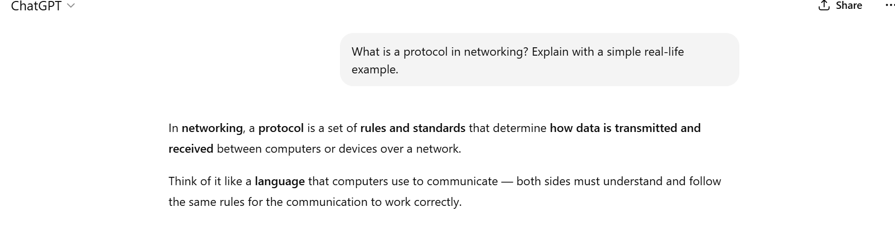
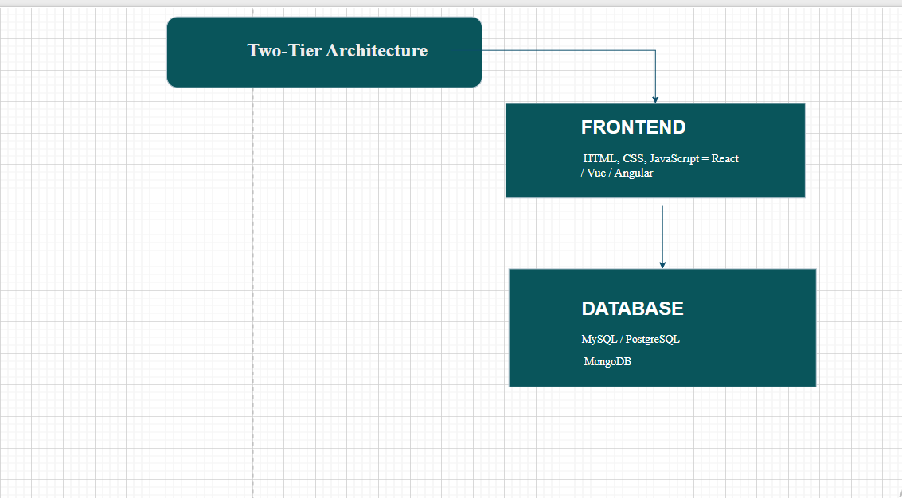

# DMI-Cohort2-task1
It covers Internet and Networking, Application Architecture, Domain and DNS management, and practical use of Visual Studio Code as a development environment. In addition, it emphasizes the importance of using ChatGPT effectively for learning and problem-solving, as well as building a professional online presence to showcase technical skills

# Devops Micro Internship Cohort 2 Task

# Task 1: Using ChatGPT as Your Learning Assistant
Write a clear ChatGPT prompt to help you understand:
“What is a protocol in networking? Explain with a simple real-life example.”

# Task 2: Internet and Networking
Your friend is launching an online bookstore named EpicReads.
He asked you to explain how users globally can access his website hosted in Finland
Write a short explanation (100–150 words) that includes:
Packet Switching
IP Address
TCP/IP
HTTP/HTTPS

EPIC READS WEBSITE
When you click to visit the EpicReads website, your device and the server over in Finland don't just chat, they swap data using a system called packet switching. Think of your book order or browser session being instantly sliced into hundreds of tiny envelopes, or packets, that travel independently across the internet.
Every piece of hardware, from your phone to the EpicReads server, has a unique address, the IP address which ensures those envelopes find their way. The TCP/IP protocol acts as the internet’s reliable postal guarantee, making sure all those packets are delivered, checked for errors, and perfectly reassembled so you see the page correctly.
Finally, the whole conversation happens using HTTP. Because you're safely buying books, they use HTTPS, which takes the extra step of encrypting all that data. This locks your payment and browsing details in a digital vault, allowing you to browse and buy securely without a second thought.

# Task 3: Application Architecture & Stack
EPIC READS TWO TIER APPLICATION ARCHITECTURE(Frontend+Database)

EPIC READS THREE TIER APPLICATION ARCHITECTURE (Frontend + Backend + Database)

# Task 4: Domain Name & DNS (Basic Concepts)
The Domain Name System (DNS) is a system that connects domain names to their corresponding IP addresses, making websites easier to find and remember. Instead of typing a long numeric address like 52.172.142.222:3000, users can simply enter epicreads.com in their browser. The DNS then translates that domain name into the actual IP address where the website is hosted.This type of IP address uses A record DNS type because it is an IPv4 address and A records handle  IPv4 mapping.

# Task 5: Visual Studio Code Setup (Hands-on)
